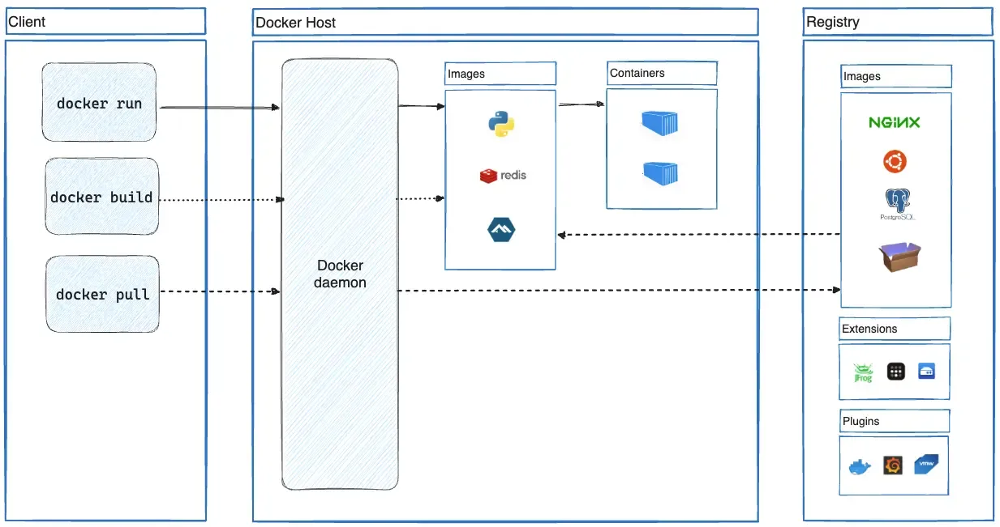

  Over the past couple of years, and one tool that's stuck with us through thick and thin is Docker Compose. Back in early 2025, we were juggling a mess of manual deployments and inconsistent environments between dev and prod. That's when we decided to give Docker Compose a real shot in production – not just for local dev, which everyone does, but for running our live services. Spoiler: it's been a game-changer for our project, even if it's not perfect for every scenario. Let me break down why we love it, where it shines on scalability, the upsides, the downsides, and toss in a real-world code snippet from our stack to show how straightforward it is.

## Quick Refresher: What Even Is Docker Compose?

If you're new to this, Docker Compose is basically a tool that lets you define and run multi-container Docker applications using a simple YAML file. Think of it as the conductor for your container orchestra – it handles networking, volumes, and dependencies without you having to micromanage each piece. We use it to spin up things like our Node.js backend, a Postgres database, and a Redis cache all in one go. No more "it works on my machine" excuses.

To visualize how it all fits together, here's a basic architecture diagram of a typical Docker setup:



## Why Bother with Docker Compose in Production?

We didn't jump into this blindly. Our production environment isn't massive – we're talking a couple of servers handling moderate traffic. Docker Compose made sense because it's dead simple for orchestrating services on a single host. Unlike full-blown orchestrators like Kubernetes, which feel like overkill for us (and come with a steep learning curve), Compose lets us deploy updates with a single command: `docker-compose up -d`. We've cut our deployment time from hours to minutes.

One Reddit thread I stumbled on nailed it – a devops engineer shared how they run Compose in prod for straightforward multi-container apps, and it just works without the bloat. That's us to a T. If your app doesn't need auto-scaling across dozens of nodes, why complicate things?

## The Good Stuff: Benefits and Pros

Alright, let's get into the meat. Here's why Compose has been a win for our developer experience:

- **Simplicity and Speed**: Defining everything in one `docker-compose.yml` file means our whole team – from juniors to seniors – can grok the setup quickly. No hunting through scripts or docs. It's YAML, so it's human-readable and version-controllable.

- **Consistency Across Environments**: Dev, staging, prod – all identical. We build once and run anywhere, reducing those pesky "but it worked locally" bugs.

- **Built-in Networking and Dependencies**: Services talk to each other seamlessly. Want your app to wait for the DB to be ready? Just add a health check or depends_on clause.

- **Easy Scaling (on a Single Host)**: We can scale services vertically by bumping resources on the server, or horizontally for stateless ones with `docker-compose up --scale web=3`. For us, that's plenty – we're not Netflix.

- **Efficient for Development to Production Flow**: Prototyping locally with Compose mirrors prod, so transitions are smooth. Plus, it's great for CI/CD pipelines; we integrate it with GitHub Actions for automated builds.

Overall, it's boosted our efficiency and made onboarding new devs a breeze. And yeah, it plays nice with other tools if we ever need to level up.

## But It's Not All Sunshine: The Cons

No tool's perfect, right? We've hit a few snags:

- **Limited Scalability for Big Setups**: If you're dealing with high-availability across multiple hosts, Compose falls short. No built-in failover or load balancing – you'd need Docker Swarm or **Kubernetes** for that. We mitigate this by running on beefy VMs with monitoring, but it's manual.

- **Manual Management**: Scaling isn't automatic; you have to handle restarts and updates yourself. Downtime can happen if you're not careful with zero-downtime strategies.

- **Security Tweaks Needed**: Out of the box, it's fine, but in prod, you gotta lock down volumes, networks, and secrets properly. We've added extra layers like Vault for sensitive stuff.

We've worked around these by keeping our architecture lean, but yeah, they're real trade-offs.

## Is It Scalable? Depends on Your Definition

Scalability's a hot topic. Compose is great for vertical scaling – throw more CPU/RAM at your host, and you're good. Horizontal scaling works for replicas on the same machine, but for distributed setups, it's not native. If we outgrow it, Swarm's a natural next step since it's Compose-compatible.

## Hands-On: A Code Example from Our Stack

To make this concrete, here's a stripped-down version of our `docker-compose.yml` for a basic web app with a database. We use this daily – just tweak the env vars for your setup.

```yaml
services:
  web:
    image: our-backend
    command: npm start
    ports:
      - '3000:3000'
    depends_on:
      - db
    environment:
      - DATABASE_URL=postgres://user:pass@db:5432/mydb
    volumes:
      - .:/app

  db:
    image: postgres:18.1
    environment:
      - POSTGRES_USER=user
      - POSTGRES_PASSWORD=pass
      - POSTGRES_DB=mydb
    volumes:
      - pgdata:/var/lib/postgresql/data

volumes:
  pgdata:
```

Run it with `docker-compose up -d`, and boom – your app's live. For scaling, add `--scale web=2`. Super dev-friendly, no PhD required.

## Wrapping Up

At the end of the day, we stick with Docker Compose in production because it keeps things simple, consistent, and scalable enough for our needs without the overhead of bigger tools.

Have a Good One
